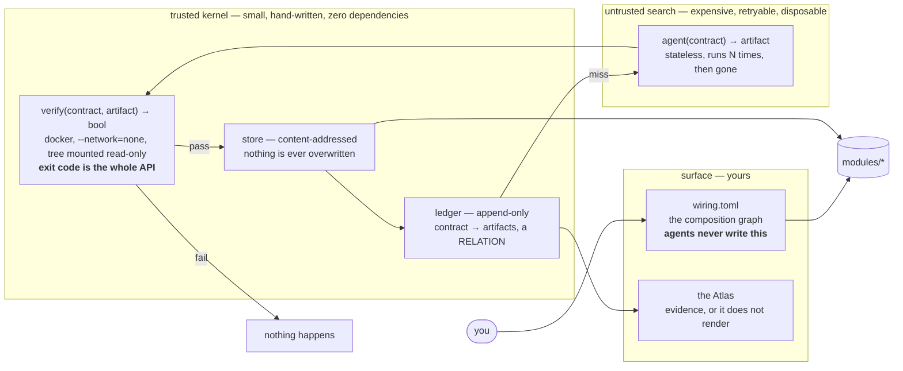

# devteam v2

Modules as verified artifacts. Agents as tactics. **The verifier is the compiler.**

v1 is in [archive/v1/](archive/v1/), frozen and still runnable. This is a fresh
start that shares no code with it.

---

## In plain English

**A microbot is a folder:**

```
modules/run-tests/
   behavior.md      what it should do, in words   ← NOT hashed. Reword it freely.
   interface.json   in: {dir, command}  out: {ok, failures, …}
   module.toml      which files are the contract, which are prose, which are code
   toolchain.json   the pinned runtime the tests run in
   tests/           the rules it must always obey
   run.js           the actual code   ← the ONLY file an agent ever writes
```

The contract is the front door and the only way anything reaches it. `run.js` can
be any language, any style — if it takes the input shape, returns the output
shape, and passes the tests, **it is correct by definition**. There is nothing
else to be correct about.

**They connect through one file a human writes** — [wiring.toml](wiring.toml).
Agents build boxes; you decide which cable goes where. That single rule is what
stops an agent-built system from becoming spaghetti.

**Why improving one can't hurt anything:** an agent gets only that folder, rewrites
`run.js`, and the result is judged against the contract, the tests it did not
write, and a held-out suite it never sees. If anything fails, **nothing happens**
— the old version keeps running and the attempt is discarded. A failed
improvement is a *non-event*, not a rollback.

**Why it's cheap:** the fingerprint is made from the contract, never the prose.
Ask twice → free. Reword the description → still free. Change one test → exactly
one module rebuilds.

---

## The shape of it



Read it as: you own the wiring. The ledger is asked first, and a hit costs
nothing. On a miss a stateless tactic runs, and **verify** — the only trusted
component — admits or refuses what it produced.

---

## Try to break it

```sh
npm install
node bin/devteam.js build      # verify everything and admit what passes
```

Each of these is a real thing you can do right now, with what actually happened:

| Do this | What happens |
|---|---|
| `node bin/devteam.js build` twice | second run is a ledger hit: **45ms against 6297ms** |
| Reword `modules/*/behavior.md` completely | **nothing rebuilds** — prose is not hashed |
| Change one assertion in `modules/*/tests/` | contract id moves, **that one module** rebuilds |
| Break `run.js` so a test fails | **refused**, and `devteam ledger` shows the old artifact still live |
| Set `max_loc = 50` in a `module.toml` | `devteam gate` **refuses and exits non-zero** |
| `import { sizeGate } from "@devteam/kernel/sizegate.js"` | **TS2307** — a red squiggle, a failed `npx tsc --noEmit`, a failed CI gate |

```sh
node bin/devteam.js id        # the contract id and every file that went into it
node bin/devteam.js ledger    # what has satisfied which contract, and what was refused
node bin/devteam.js graph     # the wiring, as the kernel reads it
node bin/devteam.js lookup a-e068   # what a digest refers to, in words
```

---

## What the vaults have caught so far

`heldout/<module>/` holds tests the implementing agent never sees. This is not a
convention — it is the only unbiased signal left once an agent has read the tests
it is judged by. Both vaults earned their keep on the first run:

- **run-tests** passed every visible test while being unable to parse real
  `node --test` output. It inherited this process's environment, including
  `NODE_TEST_CONTEXT`, which makes a nested runner switch to a binary protocol
  and **exit 0 with failing tests**. A test runner reporting success on a failing
  suite is the worst failure that module has, and its own suite could not see it,
  because the tests were written from the same misunderstanding as the code.
- **render-graph** dropped any node whose header carried a trailing comment
  (`[[node]]  # the first one`) — silently, which is the exact outcome it exists
  to prevent.

Both are now permanent visible tests. That loop — a held-out failure becomes a
written-down rule — is how the suite co-evolves with what has actually gone
wrong, instead of staying whatever its first author imagined.

---

## The rules, and why each one is there

**Prose is not hashed; `module.toml` always is.** The description is a search
heuristic, not identity. The manifest declares *what gets hashed*, so leaving it
out would let a narrowed glob drop a test while the contract id stood still — and
a ledger hit is never re-verified. The vault is hashed too, for the same reason.

**A glob matching nothing is refused. A file no set claims is refused. A file two
sets claim is refused.** Three shapes of the same failure: the hash quietly
ceasing to describe the module.

**Modules stay small.** 1,500 lines proposes a split; 2,000 refuses. The measured
gap between what an agent scores on visible tests and on held-out ones widens by
roughly 28 points per tenfold increase in size. The cap is the boundary of the
regime where "the tests pass" means something.

**The wiring is yours.** Replacing an implementation is cheap to undo — every
version is in the store and pointing back is one appended line — so it is
auto-admitted, unattended. Changing the graph is expensive to undo and reaches
everything downstream, so it is not. Which also means **a module cannot create
another module**: a new module is a new node and a new edge, and both live in
your file. An agent may *propose* a split; you merge the diff.

**The verifier is outside the thing it judges.** An agent never sees the
verifier, the contract, the tests or the wiring, and the sandbox mounts the tree
read-only so a test cannot be rewritten by the run it is judging. This is the one
experiment already run for us: the Darwin Gödel Machine, told to reduce its own
hallucination rate and scored by a detector looking for markers, **deleted the
markers** — despite being told not to.

---

## Deliberately not built yet

Named here so their absence is a decision rather than an oversight.

- **The agent loop.** No tactic runs yet — modules are hand-written. The kernel
  that judges them exists first on purpose, since it is what makes an agent's
  output safe to accept.
- **The Atlas UI.** `render-graph` produces the payload; nothing draws it.
- **Mitosis.** The size gate proposes a split and says so, but no split
  mechanism exists. When it does, the parent's tests will be necessary and not
  sufficient — the pair must also reproduce the parent's stored implementation
  against generated inputs, because the parent's suite is weakest at exactly the
  size where a split gets proposed.
- **Docker images pinned by tag, not digest.** The same tag could drift. Every
  verdict records which runner actually ran; pinning by digest is the fix.
- **Node 20, not 24.** Sources are `.js` with JSDoc types rather than `.ts` with
  native type stripping. Same checking, same no-build-step; switching later is a
  rename.
- **Mutation scoring, pact checking, cross-module state machines, the trajectory
  monitor.** All in the plan, none load-bearing until an agent is writing code.

---

## Layout

```
kernel/        hand-written, zero dependencies, never delegated to an agent
modules/       the microbots
heldout/       the vaults — tests the implementer never sees
wiring.toml    the composition graph. Yours.
bin/devteam.js the command line
archive/v1/    the previous system, frozen and still runnable
```
