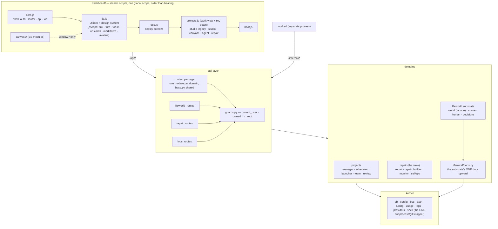

# How devteam works

Written from a full read of the code, not from memory. If this file and the code
disagree, the code is right and this file is a bug.

---

## The whole system on one diagram

After the 2026-08 modularization this is the load-bearing shape; every arrow is real
(imports for the backend, load order + calls for the frontend).



Three rules keep the diagram true: the substrate reaches the platform only through
`ports.py`; every subprocess goes through `shell.py`; every router gets its guards from
`guards.py`. The full refactor record is in `REFACTOR_PLAN.md`.

**The fleet.** The process above is becoming a fleet of processes: `services.yaml` (repo
root) is the registry, `tools/gen_fleet.py` generates the process-compose config plus
per-service env/tokens/topology from it, and `./run-local.sh` boots everything under
**process-compose** (readiness probes, restarts, a token-authed REST API on 8899).
Managed today: the conductor, **knowledge** (8881, P1), **usage** (8882, P2),
**notify** (8883, P2), **watch** (8884, P3), **lifeworld** (8885, P4) and **modgraph**
(8886, P5) — all six extracted, each meeting `SERVICE_CONTRACT.md` and reached same-origin
via the conductor's
`/svc/<name>/…` gateway. Traffic runs one way — the conductor calls its services — with
five narrow doors back: `POST /internal/bus` (a service putting an event on the platform
bus; the events table keeps its single writer), `GET /internal/tuning` (one of the owner's
knobs), `POST /internal/complete` (**the model door** — one completion, for a service that
holds no credentials), and the two `/internal/agents` requests (the platform-wide activity
register, which has to be ONE board). Every one checks the caller's own minted token
against the `doors:`/`knobs:` allowlists in `services.yaml`. `peers:` is the same idea for
the fleet's one service→service edge: it names which peer a service may call and is why
the generator writes `KNOWLEDGE_TOKEN` into `data/env/lifeworld.env` and nowhere else. The
diagram keeps its current shape until the Atlas's cards become those services (P6).

**knowledge (8881).** What agents have learned no longer lives in the conductor's database:
`services/knowledge` owns `data/knowledge.db` and answers `/recall`, `/remember`,
`/reinforce`, `/forget`, `/stats`, `/tokens` behind `X-Service-Token`. The embedding key
rides each request body — model credentials never leave the conductor.
`conductor/app/knowledge.py` keeps every public name it always had and is now a pure
client (2s timeout, ~5ms p50 budget); there is no in-process fallback, so `KNOWLEDGE_URL`
is required and `init()` refuses to boot without it, naming `run-local.sh`. Both boot
paths supply it: the fleet through `data/env/conductor.env`, `--legacy` by starting the
service as a child itself. When the service is down the client degrades rather than
blocking: recall `[]`, writes no-op, stats `degraded: true`, and the module graph's
knowledge card goes red through that same door — a knowledge base that is unreachable
must cost a sprint nothing but its memory.

**usage (8882).** The shared quota meter: every model call on the box, tagged by source,
so the self-repair crew can tell "the owner is working right now" from "the window is
free". It was one kv blob rewritten whole on every note — a lost update on the exact
number that authorises spending someone else's subscription — and it is now a real
`usage_rows` table in `data/usage.db`, one INSERT per call. `/note`, `/snapshot`,
`/verdict`, `/rows`. Attribution is **explicit on the wire**: `providers.complete` gained
a `source` argument resolved at its top, so the conductor's `usage.attributed` contextvar
is read at the call site and never crosses the boundary. `conductor/app/usage.py` keeps
every public name it always had and is now a pure client; `USAGE_URL` is required and
`init()` refuses to boot without it, naming `run-local.sh`, then drops the two kv keys the
strangler left behind (`usage:ledger`, `usage:backfilled`). The crew's own `repair:ledger`
counter stays — it is the backstop meter, not the meter — and importing its pre-meter
history moved into the service's one-shot first-boot copy, so there is exactly one
importer. The service reads the four dials it runs on (window, budget, idle share, quiet
period) through `GET /internal/tuning`, cached ~30s, keeping the last value it actually
saw rather than falling back to a default that could re-widen an allowance the owner
narrowed. Degraded: `note` is dropped (metering
must never break the thing being metered), `snapshot` is zeros with `degraded: true`, and
`verdict` **fails safe** — `(False, "usage meter unreachable", now + 300)`. That one verb
refuses rather than shrugs, because "I cannot see the quota" and "the quota is free" are
opposite answers; the five-minute bound is what makes it a pause rather than a shutdown,
and the crew resumes on `pc start usage` with no restart.

**notify (8883).** Getting word out when nobody is watching the dashboard: one GitHub
issue per distinct fault, a ceiling per hour, and the call itself. Both rules are state,
and that state was two more kv blobs — so `data/notify.db` holds `notify_seen` (one row
per fingerprint, counted in SQL) and `notify_sent` (one row per issue filed).
`/error`, `/issue` (generic), `/status`, `/forget`. It is the **first service beyond the
conductor to hold a credential**: `GITHUB_TOKEN` follows the call it belongs to, declared
in `services.yaml`'s `env:` list and named as the contract's one exception. The target
repo is derived from the git remote, so it rides each request instead; `sprint_digest`
stays conductor-side because it is a JOIN over projects and tasks, and posts its finished
text through `/issue`. A filed issue is announced back through `POST /internal/bus`.
`conductor/app/notify.py` is a pure client too: `NOTIFY_URL` is required, `init()` refuses
without it and drops the migrated `notify_seen:*` records and the `notify_sent` window.
Degraded: every verb answers `{"sent": false, "reason": "notify service down"}` — silence
is this module's designed failure mode, and the daily self-check completes without it.

**watch (8884).** The log ring and the monitor, which were always one idea. `data/watch.db`
holds `log_rows` (capped 3000), `error_rows` (capped 300) and `decisions`; before P3 all of
that was four kv values, the ring rewritten whole on every single line. `POST /logs` takes a
**batch**; `/logs`, `/logs/stats`, `/notices`, `/notices/{fp}/decide`, `/auto`, `/summary`.
It is the only extracted service with **no doors** — detection reads log rows and nothing
else, so it asks the conductor for nothing.

*The split.* watch owns FACTS + DETECTION: the two rings, the seven log-derived rules, the
notices, the decisions store and the standing `auto` flag. The conductor keeps JUDGMENT +
ACTION, because every action a notice can propose targets conductor-resident machinery —
`ACTIONS` (repair.toggle, tuning.set, repair.abort, repair.save_backlog), `approve()`,
`sweep()`, `AUTO_SAFE`. The two rules whose evidence is not a log row stayed as **local
rules** (`_rule_queue` on `repair:queue`, `_rule_stuck` on `repair.state()`), which is what
erased the platform's last cross-owner kv read: had they moved, another module's key would
have been opened by another *process*. So `/api/logs/notices` is a **composition** — watch's
notices plus the local ones, one list, one sort order, deduped by fingerprint — and
`approve(fp)` resolves from either source, runs the action locally, then POSTs the decision.
Nothing on the screen says which half a notice came from.

*The hot path.* 64 fire-and-forget log call sites, some inside exception handlers, some in a
20s tick — none can afford a round-trip. `conductor/app/logs.py` keeps the **stdout echo
local** (process-compose collects it; the 3am terminal must not depend on another process),
queues the row in memory, and lets a daemon thread POST batches of ≤100 rows or every 500ms.
Overflow beyond 1000 queued rows drops the newest with one stderr note — never through
`logs.*` itself, which would recurse — and an outage holds what it has until recovery
flushes it. Reads flush first, so a caller always sees its own writes. `logs.log()` returns
in under a millisecond always: `LOG_CALL_BUDGET_S`, timed with the service unreachable.
Degraded: stdout keeps working, reads are `[]`, stats are zeros with `degraded: true`, and
the notice list falls back to the local rules with a `banner` the screen shows — an empty
inbox during an outage must never read as "the platform has been behaving". Both shims are
pure clients since the cutover: `WATCH_URL` is required, `logs.init()` refuses without it
naming `run-local.sh`, and it is the one door for both halves of the seam. It then drops the
four kv keys the strangler left behind (`logs:ring`, `logs:errors`, `monitor:decisions`,
`monitor:auto`) — but **only after the service confirms it has copied them**, over a
`backfilled` flag on `GET /health`. Nothing orders the two processes, and deleting
`monitor:decisions` mid-copy would not lose data anyone can shrug at: it would lose every
answer the owner has ever given and ask all of them again at once, which is the exact storm
the copy exists to prevent. `monitor:auto` is the same hazard wearing a settings hat — its
absence silently turns unattended approval off.

**lifeworld (8885, P4).** The plan's highest-risk phase: the whole substrate — the
26-file package, the 35 `/api/lw/*` handler bodies and the `lw_worlds` blob — moved into
`services/lifeworld`, which owns `data/lifeworld.db` alone. The legacy Studio (`home.py`,
the `home_*`/`scenes`/`artifact*` tables, `routes/studio_legacy.py`) stayed: the cut was
clean because `store.py` only ever persisted through `ports.db().list_lw_worlds`.

*The dependency inversion.* `ports.py` was already the substrate's one door upward, so the
extraction turned each accessor into a client rather than moving anything: `knowledge()`
calls the P1 service directly (asking the conductor to ask would be two hops for one
answer), `tuning()` and `agents()` call the conductor's doors, and `providers()` calls
`POST /internal/complete`. **Model credentials never leave the conductor.** A live world
carries a `settings_ref` — a short HMAC-signed string naming a principal
(`auth.mint_settings_ref`) — in the exact place the settings dict used to sit; the
substrate passes it along and cannot read it, and a forged one resolves to nothing. The
one honest consequence: a lifeworld recall uses knowledge's free local backend, because
the embedding key is a credential too. Knowledge re-embeds a row locally when the backends
differ, so a lesson written with a real embedder is still found — coarser, never absent —
and the conductor's own recalls (the specialist briefing, the knowledge row written after
an outcome) keep the key and stay conductor-side.

*The paths did not move.* The dashboard hardcodes `/api/lw/*` in fifty-odd places, so the
conductor keeps them as an authenticated thin proxy: it resolves the session cookie, stamps
who the caller is (`X-Lw-Owner`, `X-Lw-Root`, `X-Lw-Settings`, `X-Lw-Source`,
`X-Lw-Author`), strips the cookie and forwards with the service's token. OWNERSHIP moved
with the `owner_id` column and is enforced service-side; the conductor authenticates, the
row authorises, and missing and forbidden are still the same 404. Two routes COMPOSE
instead of forwarding: the world list hides the crew's own world (a repair fact, whose
record is conductor kv) and the agent panel adds root's log rows (a watch fact).

*The hardest cut: the crew.* `repair.py` used to import `materialise_manifest` from a route
module and then perform deep surgery on live `Human` objects. All of it is now WHOLE
BEHAVIOURS on the service — `crew-seating`, `crew-context`, `crew-decision`,
`crew-outcome`, `crew-consult`, `crew-review`, `crew-deliberate` — because every one is a
read-modify-write on a world blob and **`store.lock_for` can only be held on one side of a
wire**. `ensure_team` is a ~30-line client that keeps its kv record and its adoption
semantics: a seating that finds a room already seating exactly these personas ADOPTS it,
ids intact, because every knowledge row the crew has earned hangs off one. Every sentence a
build session can read (the consult refusal naming its real neighbours) is still composed
conductor-side, from a machine-readable reason.

*Degraded.* `/api/lw/*` answers an honest 503 rather than an empty world the next save would
persist. `seat_crew` returns `None`, so the sprint tick logs and **sleeps with the reason
"lifeworld down"** on a bounded 60-second wake — pausing is the honest behaviour, since a
crew without its specialists would still be spending, just anonymously — and it resumes
with no restart and no lost sprint (it resumes the PHASE it was in, not a fresh sprint). A
consult or review declines and the build carries on alone; a decision or outcome is simply
not recorded; room members answer `None`, so the Atlas panel and the assignment pool read
"unavailable" rather than "empty".

*The cutover.* `LIFEWORLD_URL` is required, `lifeworld_client.init()` refuses without it
naming `run-local.sh`, and `--legacy` gained it as its fifth child. The `lw_worlds` table left
the conductor's schema — and it is dropped **conditionally**, exactly like watch's four kv
keys in P3: nothing orders the two processes, so `init()` asks `GET /health` for
`backfilled` first, and a service that has not settled its first-boot copy keeps the table
alive for the next boot to try again. The stakes are why: dropping early would lose every
world on the box, with every association each specialist ever proved hanging off human ids
that would never exist again. P4-A also deliberately did NOT rename the table aside the way
the earlier phases did, because the rollback then was the package itself, which read
`lw_worlds` by name — a rename would have made a rollback find an empty table and re-seat
the crew with new ids. The rows stayed put, the service copied them out with the ROWIDS
PRESERVED, and the conductor dropped its copy only after being told it was safe.

*The tests split where the code did.* `services/lifeworld/tests/` gained the engine's own
suites (the substrate, decision memory, the routing rules) because nothing outside a
service's directory may import inside it, and a conductor suite that unit-tested another
process's objects would be testing a copy of them. The conductor kept the DOORWAY and the
SEAM: `/api/lw/*` end to end, the crew drills, and the source-level claims that read the
engine's files rather than importing them.

**modgraph (8886, P5).** The last extraction before the Atlas is rewired. The six
`graph_*` tables — the immutable plan versions, their nodes and typed edges, the
append-only TRACE, the test mapping and the per-node assignment — moved into
`services/modgraph`, which owns `data/modgraph.db` alone, together with the layout kv and
the three things computed FROM those rows: the derived group tier, affected-only test
selection, and mastery.

*Where the cut went, and why the derivations came too.* A derivation performed on a copy of
a table you no longer own can disagree with the table. `derive_group_edges` is the clearest
case: the SEED calls it to build the plan it writes and the PAYLOAD calls it again to
reconcile what a manager authored, so two copies on two sides of a wire is how the stored
plan and the rendered graph start telling different stories about the same repository.
`mastery` came for the opposite reason — it is a JOIN (`graph_node_runs ⋈ graph_plans`) and
both its tables went, so it stayed a join instead of becoming HTTP composition. A join you
can still write is a join that was inside the boundary.

*The cycle breaks here.* `modgraph_author` — the crew's hidden manager authoring the plan
its specialists will work — did NOT move, and that is the point of the phase. It needs
`providers.complete` with the owner's resolved settings, the repair engine's headroom and
ledger, the crew's roster, a tuning knob and the bus: the conductor, five times over. It is
a BRAIN and the service is a STORE, so `modgraph_author ↔ repair` — the one genuine import
cycle in the whole decomposition — became one HTTP call in one direction. The service
declares **no doors, no peers and no extra env**; it asks the conductor for nothing, and a
grep test pins that nothing inside the directory imports it.

*Two things stayed with the conductor for the same kind of reason.* The affected-tests
RUNNER shells out to the repo's own pytest over real files in the checkout the conductor is
serving from — the store says which files and records the verdict, but a store that spawned
pytest in another process's working tree would have imported that tree's whole world. And
`modgraph_health`'s per-module probes import the very modules they check; P6 deletes them
outright in favour of process-compose's live state, so P5 left the health model alone
deliberately — a phase that also rewrote it would have made "did the Atlas render
identically" unanswerable.

*The screen did not move.* `routes/graph.py` stays the BFF, every `/api/graph/*` path is
unchanged (the Atlas hardcodes them), and the payload is still composed there from the
service's rows plus facts only the conductor has. Two shapes are new because the boundary
changed what is expensive or safe: `GET /plans/{id}/assigns` answers for every node in one
call (per-node reads would be fourteen round trips on a payload that is polled), and
`POST /plans/import` writes a whole version in one transaction — both bulk writers, the
authoring pass and the operator removing a node, used to write fifty-odd rows in one
process, and over a wire that is fifty chances to be interrupted with the plan already
ACTIVE and half its edges missing.

*Degraded — and this is the phase's one judgement call.* **A trace gap is recorded as a
gap, never as a block.** When the lifeworld is down the crew PAUSES, because a crew without
its specialists would still be spending, anonymously. When the module graph is down the
crew must NOT: the code still gets written, the tests still run, the commit still lands, and
all that is lost is the record of which module it happened on. The graph is observability,
not the substrate, and a platform that stopped improving itself because its map was
unavailable would have the priority backwards. So `note_run` returns 0 (falsy on purpose —
a fabricated id would close somebody else's row on recovery), `close_run` is a no-op, reads
are empty with `degraded: true`, and `/api/graph/self` answers **200 with an honest "the map
is unavailable"** rather than a 503 — the opposite of the Studio's call, because nothing the
Atlas draws is ever saved back. Two shapes are chosen against the grain: `mastery` degrades
to `None` and not `{}`, since an outage reading as "nobody has earned anything" would let
one reshuffle undo every earned continuity; and the authoring pass REFUSES before it spends,
because a real model call to author a decomposition of an unreadable inventory would produce
a plan with nowhere to land.

*The cutover.* `MODGRAPH_URL` is required, `modgraph.init()` refuses without it naming
`run-local.sh`, and `--legacy` starts all six services. The six `graph_*` tables left the
conductor's schema (33 declared tables → 27) — and they are dropped **conditionally**, like
watch's four kv keys in P3 and `lw_worlds` in P4: nothing orders the two processes, so
`init()` asks `GET /health` for `backfilled` first, and a service that has not settled its
first-boot copy keeps them alive for the next boot to try again. The stakes are narrower
than the lifeworld's and worth naming exactly: plans, nodes and edges regenerate from the
tree in under a second and the manager re-authors on the next lineup change, but
`graph_node_runs` does not — it is every build and verify any specialist has closed, and
MASTERY IS COUNTED FROM IT rather than stored. Dropping it early would silently un-master
every module, so the next authoring pass would reshuffle specialists off work they had
earned, with nothing anywhere reporting the loss; `graph_assign`, the operator's own
steering, would go the same way. The layout keys (`graph:pos:{plan_id}`) are dropped with
them because they are keyed to a plan id that now lives in another process's database.
Three graph kv keys deliberately STAY conductor-side, because they were never storage: the
operator's directives to the manager (`graph:notes:0`), the authoring staleness stamp, and
the assignment-pool pointer. P5-A also did not rename the tables aside, because the rollback
then was the vendored body, which read them by name.

*The tests split where the code did.* `services/modgraph/tests/` gained the seed's claims
about the working tree, the immutable-version rules, the pure derivation and mastery's
arithmetic. The conductor kept the seam and the screen: the payload, the verify runner, the
authoring brain entire, the Atlas pins, and the boundary drills.

---

## The one-paragraph version

You describe an idea. A **manager** agent plans it as a DAG of tasks and hires a
team. A **scheduler** — plain code, no model, no tokens — dispatches every task
whose dependencies are finished to a **worker** agent, which clones the repo,
does the work on its own branch, pushes, and reports back. The scheduler opens a
PR; the manager reviews it and either merges or sends it back. You watch, answer
questions, and can stop anything at any time.

The bet: many cheap-model iterations, orchestrated well, beat one expensive model
with a human babysitting it.

---

## The four moving parts

| Part | Lives in | What it is | Costs tokens? |
|---|---|---|---|
| **Manager** | `conductor/app/manager.py` | One Claude session per active project, with 13 tools and no file access | yes |
| **Scheduler** | `conductor/app/scheduler.py` | An 8-second `asyncio` loop per project | **no** |
| **Launcher** | `conductor/app/launcher.py` | Starts/stops workers; picks the model | no |
| **Worker** | `worker/worker.py` | A separate process (or k8s Job) with Bash, Read/Write/Edit | yes |

The split matters: **the manager never dispatches anything**. It writes rows in
the database; the scheduler notices and acts. That means orchestration mechanics
(who runs next, retries, PR opening) cost nothing, and a manager that dies
mid-project loses no work.

---

## The life of a task

```
manager.create_tasks()      → status=planned      (rows only, no execution)
scheduler sees deps all done→ launcher.dispatch_task()
                            → status=queued       (attempts+1, model chosen)
worker starts, emits        → status=running
worker pushes + reports     → status=pushed  (or failed)
scheduler opens the PR      → status=review
manager merges / accepts    → status=done         → unblocks dependents
manager requests changes    → status=planned + feedback → dispatched again
```

Every transition is written to `tasks.status`. Two things watch for lies:

- the **stall watchdog** (`scheduler.py`) fails any task stuck `queued` or
  `running` with no update for `WORKER_STUCK_SECONDS` (default 30 min)
- the **startup sweep** (`launcher.sweep_orphans`) fails everything still
  `queued`/`running` at boot, because a local worker is a child process and
  cannot outlive the conductor — on `LAUNCHER=k8s` it instead defers to
  `K8sLauncher.reap_orphans`, which checks each task's Job before failing it,
  since a Job outlives a conductor restart

### How the model is chosen

`launcher.pick_model()`, in strict precedence order:

1. `pinned_model` — the manager explicitly reassigned it. Wins over everything.
2. Rate-limit fallback — the last attempt looked throttled, so pick another
   model that isn't cooling down.
3. `attempts >= 2` → `ESCALATION_MODEL` (Sonnet by default). This is the
   automatic "cheap model failed twice, send someone better" rule.
4. The recruited roster's per-role model choice.
5. `agents/roles.json` for that role.
6. `WORKER_MODEL` (Haiku).

**Caveat worth knowing:** step 1 disables step 3. Once the manager pins a model,
escalation never fires for that task again.

### Contests

Judging is **blind and shuffled**: attempts are shown in random order with the
authoring model withheld, and attempts that delivered nothing are filtered out
before judging. All three are deliberate — LLM judges are measurably sensitive to
candidate ordering, favour output from their own model family, and selection over
a pool containing failures underperforms plain majority voting.

A task created with `compete: 2` (or 3) launches N rivals on branches
`task/<id>-c1`, `-c2`… each on a different model. When all report, the manager
sees them side by side (`compare_work`) and picks one (`pick_winner`); the
winner's branch becomes the task's branch and the losers are discarded.

---

## Who talks to whom

```
        you (browser)
             │  REST + one WebSocket (auth'd, filtered to your projects)
             ▼
      ┌─────────────┐   writes rows    ┌──────────┐
      │  conductor  │◄─────────────────│ manager  │  (in-process Claude session)
      │  (FastAPI)  │                  └──────────┘
      └──────┬──────┘                        ▲
             │ reads rows                    │ 13 MCP tools
        ┌────▼─────┐                         │
        │scheduler │─── dispatch ──► launcher ──► worker (subprocess or k8s Job)
        └──────────┘                                 │
                        POST /internal/report ◄──────┘
```

The worker never touches the database directly. It reports over HTTP with a
shared `WORKER_TOKEN`, and the conductor verifies the task it reports on really
belongs to the project it claims.

---

## Files, one line each

### Conductor (`conductor/app/`)

| File | Responsibility |
|---|---|
| `main.py` | Startup: init DB, sweep orphaned tasks, resume in-flight projects |
| `config.py` | Every env var, with defaults. `DB_PATH` is anchored to the repo root |
| `db.py` | SQLite schema + all queries. Tables: projects, tasks, events, inbox, contenders |
| `auth.py` | Users, sessions, per-user credential storage (PBKDF2) |
| `routes/` | Every HTTP route and the WebSocket, one module per domain on a shared router. The authorization gates (`owned_project`/`owned_task`/…) live in `guards.py` |
| `bus.py` | In-memory pub/sub; every event is persisted *and* broadcast |
| `manager.py` | The manager agent and its 13 tools |
| `scheduler.py` | The token-free dispatch loop, PR opening, stall watchdog, status reconciliation |
| `launcher.py` | Worker start/stop, model selection, rate-limit cooldowns, credential isolation |
| `blockers.py` | Derives "what is standing in the way" on read — never stored |
| `planner.py` | Suggests a team from your brief (domain-agnostic) |
| `preview.py` | Static-file preview of a project's build |
| `deploy.py` | Runs the *real* app: local subprocess or a k8s Deployment |
| `selfops.py` | The platform working on itself: file an issue, deploy, roll back |
| `github_client.py` | Issues, PRs, branches, merges |

### Elsewhere

| Path | Responsibility |
|---|---|
| `worker/worker.py` | The worker agent: clone → work → push → report. Has `ask_teammate` |
| `agents/manager.md` | The manager's system prompt (disposition, workflow, rules) |
| `agents/roles.json` | Built-in roles: model, max_parallel, fan-out policy |
| `agents/{backend,frontend,tester}.md` | Built-in role prompts. Unknown roles get a generic one |
| `dashboard/` | Vanilla JS, no build step. the client is `js/core.js` → `js/lib.js` → `js/ops.js` → `js/projects.js` → `js/studio-legacy.js` → `js/studio.js` → `js/canvas1.js` → `js/agent.js` → `js/repair.js` → `js/boot.js` (classic scripts, one global scope, loaded in `index.html` order) plus the `canvas2/` ES module and `graph/` — **the Atlas** (`#/graph`): the module graph as rooms-and-doors navigation — one room on screen at a time (top level or inside a group), dependency-column CSS grid, door chips derived from real edges, keyboard + a full-tree map overlay; no free camera |
| `deploy/` | Dockerfiles, k8s manifests, the kind rehearsal cluster |

---

## The database

Five tables. `db.py` is the only writer.

- **projects** — the brief, repo, status, owner, autonomy, manager model and
  persona, the recruited `team` roster (JSON), caps (`max_workers`, `max_runs`),
  and `is_self` for the platform's own row.
- **tasks** — role, title, description, `status`, `deps` (JSON of *global* task
  ids), `seq` (the per-project number humans see), `branch`, `attempts`,
  `model` (what the last run used) vs `pinned_model` (an explicit override),
  `compete`, `feedback`, `report`.
- **events** — append-only activity feed. Everything the UI shows comes from here.
- **inbox** — the two-way boss/manager channel: `directive` (you → manager) and
  `question` (manager → you, which pauses the project on `hold`).
- **contenders** — rival attempts at one task during a contest.

**Task numbering:** `id` is global and is used for branches, deps and API paths.
`seq` is per-project (1, 2, 3…) and is what the UI and the manager both speak.
`db.resolve_task()` maps a number to a task, preferring `seq`.

---

## Money and limits

On a **subscription** nothing is billed per token, so `db.add_project_cost()`
records 0 and the dollar budget is inert by design — gating on it caused
managers to cut projects short over phantom spend. The real rail is
`max_runs`: the number of agent runs a project may consume.

With an **API key**, `cost_usd` is real and both the scheduler and the launcher
stop dispatching at `budget_usd`.

Rate limits are learned, not published: `launcher.looks_rate_limited()` reads
the error text, `note_rate_limit()` parses any retry-after, and the model is put
in cooldown so `pick_model` routes around it. Anthropic exposes no
remaining-quota endpoint for subscriptions, so the Agents tab shows observed
health, not a real quota.

---

## Credential isolation

Each user's agents run on **that user's** credentials. This is enforced in
`launcher.owner_credentials()`, and it is subtler than it looks: the worker
environment is `{**os.environ, **env}`, so any variable we *don't* set is
inherited from the operator's shell. The function therefore always sets both
`ANTHROPIC_API_KEY` and `CLAUDE_CODE_OAUTH_TOKEN` (one may be `""`) and
redirects `CLAUDE_CONFIG_DIR`, because the `claude` CLI login lives under the
operator's `HOME`. A project whose owner has no credentials is refused at
dispatch rather than quietly running on whatever is lying around.

---

## Running it

```bash
set -a && source .env && set +a        # there is no dotenv loader; this is required
PYTHONPATH=conductor uvicorn app.main:app --host 0.0.0.0 --port 8000
```

`LAUNCHER=local` runs workers as subprocesses; `LAUNCHER=k8s` runs them as Jobs.
Deploying a project's *app* is chosen per request, independently of that.

See [KNOWN_ISSUES.md](KNOWN_ISSUES.md) for what is broken, and
[UI_ACTIONS.md](UI_ACTIONS.md) for what each button actually triggers.
