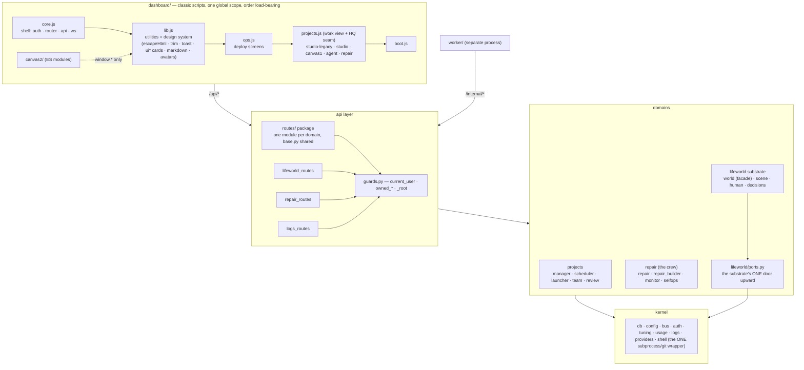

# How devteam works

Written from a full read of the code, not from memory. If this file and the code
disagree, the code is right and this file is a bug.

---

## The whole system on one diagram

After the 2026-08 modularization this is the load-bearing shape; every arrow is real
(imports for the backend, load order + calls for the frontend).



Three rules keep the diagram true: the substrate reaches the platform only through
`ports.py`; every subprocess goes through `shell.py`; every router gets its guards from
`guards.py`. The full refactor record is in `REFACTOR_PLAN.md`.

---

## The one-paragraph version

You describe an idea. A **manager** agent plans it as a DAG of tasks and hires a
team. A **scheduler** — plain code, no model, no tokens — dispatches every task
whose dependencies are finished to a **worker** agent, which clones the repo,
does the work on its own branch, pushes, and reports back. The scheduler opens a
PR; the manager reviews it and either merges or sends it back. You watch, answer
questions, and can stop anything at any time.

The bet: many cheap-model iterations, orchestrated well, beat one expensive model
with a human babysitting it.

---

## The four moving parts

| Part | Lives in | What it is | Costs tokens? |
|---|---|---|---|
| **Manager** | `conductor/app/manager.py` | One Claude session per active project, with 13 tools and no file access | yes |
| **Scheduler** | `conductor/app/scheduler.py` | An 8-second `asyncio` loop per project | **no** |
| **Launcher** | `conductor/app/launcher.py` | Starts/stops workers; picks the model | no |
| **Worker** | `worker/worker.py` | A separate process (or k8s Job) with Bash, Read/Write/Edit | yes |

The split matters: **the manager never dispatches anything**. It writes rows in
the database; the scheduler notices and acts. That means orchestration mechanics
(who runs next, retries, PR opening) cost nothing, and a manager that dies
mid-project loses no work.

---

## The life of a task

```
manager.create_tasks()      → status=planned      (rows only, no execution)
scheduler sees deps all done→ launcher.dispatch_task()
                            → status=queued       (attempts+1, model chosen)
worker starts, emits        → status=running
worker pushes + reports     → status=pushed  (or failed)
scheduler opens the PR      → status=review
manager merges / accepts    → status=done         → unblocks dependents
manager requests changes    → status=planned + feedback → dispatched again
```

Every transition is written to `tasks.status`. Two things watch for lies:

- the **stall watchdog** (`scheduler.py`) fails any task stuck `queued` or
  `running` with no update for `WORKER_STUCK_SECONDS` (default 30 min)
- the **startup sweep** (`launcher.sweep_orphans`) fails everything still
  `queued`/`running` at boot, because a local worker is a child process and
  cannot outlive the conductor — on `LAUNCHER=k8s` it instead defers to
  `K8sLauncher.reap_orphans`, which checks each task's Job before failing it,
  since a Job outlives a conductor restart

### How the model is chosen

`launcher.pick_model()`, in strict precedence order:

1. `pinned_model` — the manager explicitly reassigned it. Wins over everything.
2. Rate-limit fallback — the last attempt looked throttled, so pick another
   model that isn't cooling down.
3. `attempts >= 2` → `ESCALATION_MODEL` (Sonnet by default). This is the
   automatic "cheap model failed twice, send someone better" rule.
4. The recruited roster's per-role model choice.
5. `agents/roles.json` for that role.
6. `WORKER_MODEL` (Haiku).

**Caveat worth knowing:** step 1 disables step 3. Once the manager pins a model,
escalation never fires for that task again.

### Contests

Judging is **blind and shuffled**: attempts are shown in random order with the
authoring model withheld, and attempts that delivered nothing are filtered out
before judging. All three are deliberate — LLM judges are measurably sensitive to
candidate ordering, favour output from their own model family, and selection over
a pool containing failures underperforms plain majority voting.

A task created with `compete: 2` (or 3) launches N rivals on branches
`task/<id>-c1`, `-c2`… each on a different model. When all report, the manager
sees them side by side (`compare_work`) and picks one (`pick_winner`); the
winner's branch becomes the task's branch and the losers are discarded.

---

## Who talks to whom

```
        you (browser)
             │  REST + one WebSocket (auth'd, filtered to your projects)
             ▼
      ┌─────────────┐   writes rows    ┌──────────┐
      │  conductor  │◄─────────────────│ manager  │  (in-process Claude session)
      │  (FastAPI)  │                  └──────────┘
      └──────┬──────┘                        ▲
             │ reads rows                    │ 13 MCP tools
        ┌────▼─────┐                         │
        │scheduler │─── dispatch ──► launcher ──► worker (subprocess or k8s Job)
        └──────────┘                                 │
                        POST /internal/report ◄──────┘
```

The worker never touches the database directly. It reports over HTTP with a
shared `WORKER_TOKEN`, and the conductor verifies the task it reports on really
belongs to the project it claims.

---

## Files, one line each

### Conductor (`conductor/app/`)

| File | Responsibility |
|---|---|
| `main.py` | Startup: init DB, sweep orphaned tasks, resume in-flight projects |
| `config.py` | Every env var, with defaults. `DB_PATH` is anchored to the repo root |
| `db.py` | SQLite schema + all queries. Tables: projects, tasks, events, inbox, contenders |
| `auth.py` | Users, sessions, per-user credential storage (PBKDF2) |
| `routes/` | Every HTTP route and the WebSocket, one module per domain on a shared router. The authorization gates (`owned_project`/`owned_task`/…) live in `guards.py` |
| `bus.py` | In-memory pub/sub; every event is persisted *and* broadcast |
| `manager.py` | The manager agent and its 13 tools |
| `scheduler.py` | The token-free dispatch loop, PR opening, stall watchdog, status reconciliation |
| `launcher.py` | Worker start/stop, model selection, rate-limit cooldowns, credential isolation |
| `blockers.py` | Derives "what is standing in the way" on read — never stored |
| `planner.py` | Suggests a team from your brief (domain-agnostic) |
| `preview.py` | Static-file preview of a project's build |
| `deploy.py` | Runs the *real* app: local subprocess or a k8s Deployment |
| `selfops.py` | The platform working on itself: file an issue, deploy, roll back |
| `github_client.py` | Issues, PRs, branches, merges |

### Elsewhere

| Path | Responsibility |
|---|---|
| `worker/worker.py` | The worker agent: clone → work → push → report. Has `ask_teammate` |
| `agents/manager.md` | The manager's system prompt (disposition, workflow, rules) |
| `agents/roles.json` | Built-in roles: model, max_parallel, fan-out policy |
| `agents/{backend,frontend,tester}.md` | Built-in role prompts. Unknown roles get a generic one |
| `dashboard/` | Vanilla JS, no build step. the client is `js/core.js` → `js/lib.js` → `js/ops.js` → `js/projects.js` → `js/studio-legacy.js` → `js/studio.js` → `js/canvas1.js` → `js/agent.js` → `js/repair.js` → `js/boot.js` (classic scripts, one global scope, loaded in `index.html` order) plus the `canvas2/` ES module and `graph/` — **the Atlas** (`#/graph`): the module graph as rooms-and-doors navigation — one room on screen at a time (top level or inside a group), dependency-column CSS grid, door chips derived from real edges, keyboard + a full-tree map overlay; no free camera |
| `deploy/` | Dockerfiles, k8s manifests, the kind rehearsal cluster |

---

## The database

Five tables. `db.py` is the only writer.

- **projects** — the brief, repo, status, owner, autonomy, manager model and
  persona, the recruited `team` roster (JSON), caps (`max_workers`, `max_runs`),
  and `is_self` for the platform's own row.
- **tasks** — role, title, description, `status`, `deps` (JSON of *global* task
  ids), `seq` (the per-project number humans see), `branch`, `attempts`,
  `model` (what the last run used) vs `pinned_model` (an explicit override),
  `compete`, `feedback`, `report`.
- **events** — append-only activity feed. Everything the UI shows comes from here.
- **inbox** — the two-way boss/manager channel: `directive` (you → manager) and
  `question` (manager → you, which pauses the project on `hold`).
- **contenders** — rival attempts at one task during a contest.

**Task numbering:** `id` is global and is used for branches, deps and API paths.
`seq` is per-project (1, 2, 3…) and is what the UI and the manager both speak.
`db.resolve_task()` maps a number to a task, preferring `seq`.

---

## Money and limits

On a **subscription** nothing is billed per token, so `db.add_project_cost()`
records 0 and the dollar budget is inert by design — gating on it caused
managers to cut projects short over phantom spend. The real rail is
`max_runs`: the number of agent runs a project may consume.

With an **API key**, `cost_usd` is real and both the scheduler and the launcher
stop dispatching at `budget_usd`.

Rate limits are learned, not published: `launcher.looks_rate_limited()` reads
the error text, `note_rate_limit()` parses any retry-after, and the model is put
in cooldown so `pick_model` routes around it. Anthropic exposes no
remaining-quota endpoint for subscriptions, so the Agents tab shows observed
health, not a real quota.

---

## Credential isolation

Each user's agents run on **that user's** credentials. This is enforced in
`launcher.owner_credentials()`, and it is subtler than it looks: the worker
environment is `{**os.environ, **env}`, so any variable we *don't* set is
inherited from the operator's shell. The function therefore always sets both
`ANTHROPIC_API_KEY` and `CLAUDE_CODE_OAUTH_TOKEN` (one may be `""`) and
redirects `CLAUDE_CONFIG_DIR`, because the `claude` CLI login lives under the
operator's `HOME`. A project whose owner has no credentials is refused at
dispatch rather than quietly running on whatever is lying around.

---

## Running it

```bash
set -a && source .env && set +a        # there is no dotenv loader; this is required
PYTHONPATH=conductor uvicorn app.main:app --host 0.0.0.0 --port 8000
```

`LAUNCHER=local` runs workers as subprocesses; `LAUNCHER=k8s` runs them as Jobs.
Deploying a project's *app* is chosen per request, independently of that.

See [KNOWN_ISSUES.md](KNOWN_ISSUES.md) for what is broken, and
[UI_ACTIONS.md](UI_ACTIONS.md) for what each button actually triggers.
